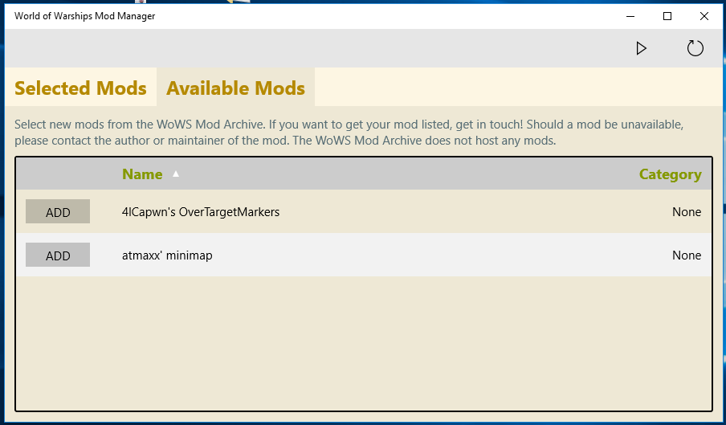

# World of Warships Mod Manager

The World of Warships Mod Manager will assist you in maintaing your favourite set of mods for World of Warships.

Just add the mods you want, and hit the Play button at the top. The Mod Manager will now merge all selected mods, and deploy them to your World of Warships installation.

## Installation

Either install via the Windows App Store (do not worry, it is free and will always be free!), or build it yourself.

## Get your mod listed

To enable others to download your mod via the Mod Manager, add it to the [World of Warships Modding Archive](https://github.com/WorldofWarshipsModding/wows_modarchive). The mod manager is able to merge xml files like `battle_elements.xml` (to some extent), so your mod may modify these without interfering with other mods.

## How does it work?

`[UNDER CONSTRUCTION]`

## How can i help?

Become a modder yourself, become a maintainer for a mod, fix bugs in our code, implement missing features, report bugs, send us money, beer and chocolate!